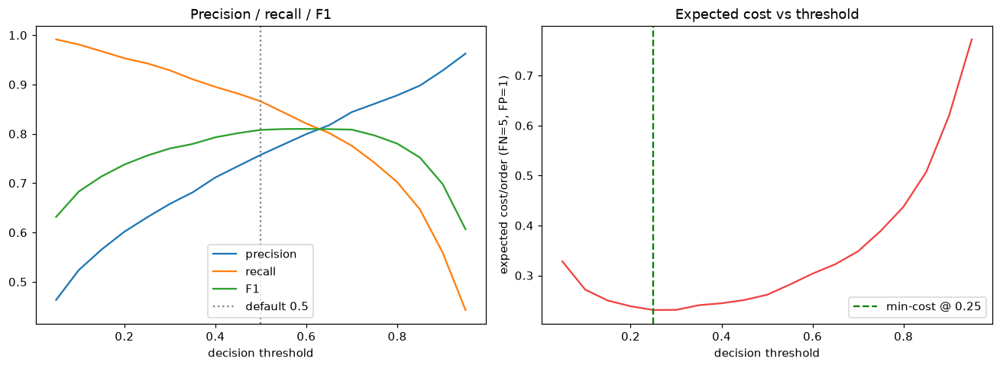
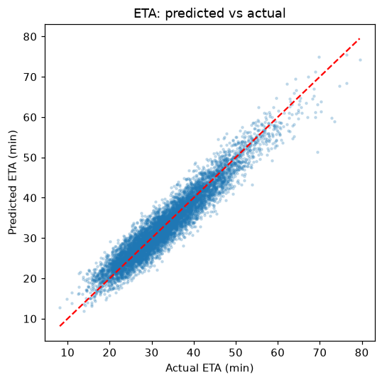
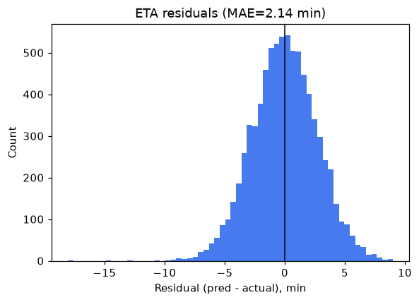
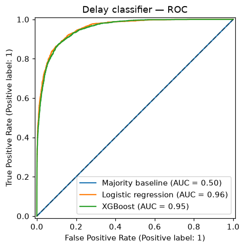
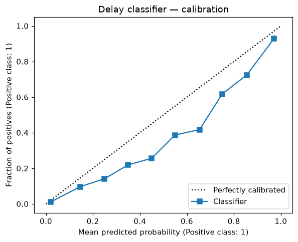
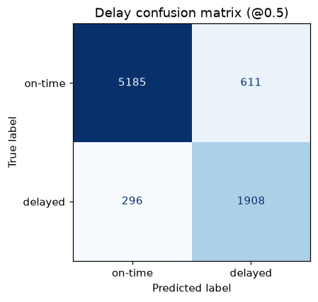
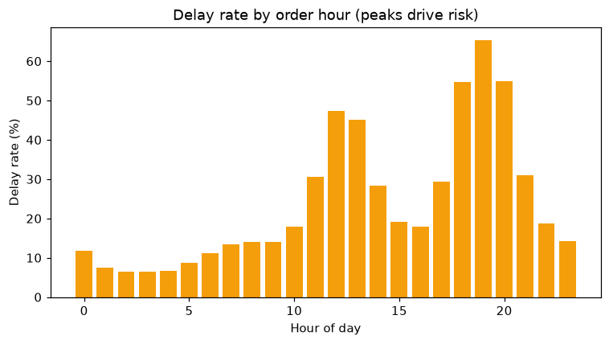
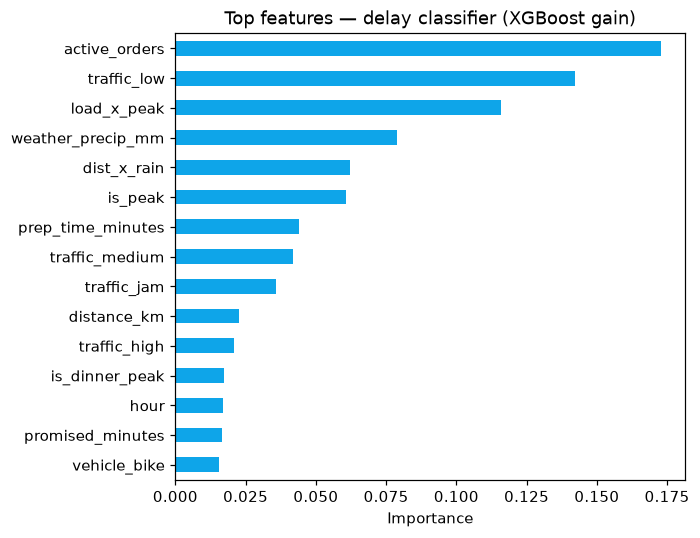
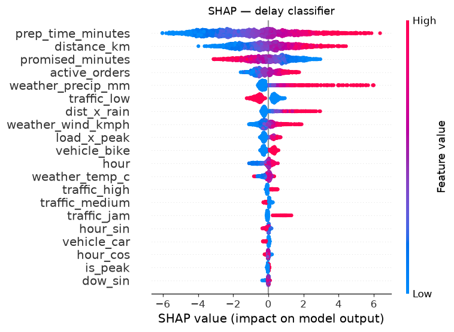

# Model Evaluation Report

_Auto-generated by `python scripts/evaluate.py`._

Dataset: **40,000** orders · base delay rate **27.6%** · median actual delivery **32.1 min**.

## ETA regression — baseline comparison
| Model | MAE (min) | RMSE (min) | R² |
|---|---|---|---|
| Mean baseline | 7.07 | 8.98 | -0.000 |
| Linear regression | 2.23 | 2.81 | 0.902 |
| XGBoost | 2.14 | 2.70 | 0.910 |

## Delay classification — baseline comparison
| Model | ROC-AUC | PR-AUC | Brier | F1@0.5 |
|---|---|---|---|---|
| Majority baseline | 0.500 | 0.276 | 0.276 | 0.000 |
| Logistic regression | 0.956 | 0.906 | 0.084 | 0.803 |
| XGBoost | 0.954 | 0.898 | 0.082 | 0.808 |

## Cross-validation (XGBoost, k=5)
| Metric | Mean | Std |
|---|---|---|
| ETA MAE (min) | 2.14 | 0.01 |
| ETA R² | 0.910 | 0.002 |
| Delay ROC-AUC | 0.951 | 0.001 |

## Business framing & operating point

Errors are not symmetric: a **missed delay** (false negative → SLA breach, refund, lost trust) is treated as **5×** the cost of a **false alarm** (false positive → a proactive nudge or padded ETA). Sweeping the decision threshold to minimise expected cost/order yields an operating point of **0.25** (vs the naive 0.50) — precision 0.63, recall 0.94, F1 0.76. Tune `cost_fn`/`cost_fp` in `scripts/evaluate.py` to your real economics.

## Diagnostics

| | |
|---|---|
|  |  |
|  |  |
|  |  |

## Explainability

